# Architecture

> 👩‍💻 **Developer Docs** — [Home](Home) › [Developer Docs](Home#developer-docs)

> **Source:** ADR-004 — AI Assistant Architecture

---

## AI Assistant

This project is a reference implementation of a Retrieval-Augmented Generation (RAG) assistant, designed to demonstrate how AI-powered search and conversational interfaces can be deployed on the Core Delivery Platform (CDP).

It is intended as a practical starting point for any teams looking to deploy similar AI features. The system prompts have not been extensively optimised, and the data structures reflect a generalised design that may require adaptation for specific use cases.

---

## Services

### Frontend Service — Node.js + Redis
- User interfaces for chat, upload, and knowledge group management
- Auth flow via Microsoft Entra ID
- Short-term conversation cache via Redis
- Triggers document upload via CDP Uploader
- Receives CDP upload callback and notifies Knowledge Service

### Agent Service — Python
- Handles all LLM inference calls to AWS Bedrock
- Persists conversation history in MongoDB
- Orchestrates RAG lookup via Knowledge Service when required

### Knowledge Service — Python
- Manages document ingestion pipeline (extract, chunk, embed, store)
- Generates embeddings via AWS Bedrock (Titan Embed v2, 1024-dim, model: `amazon.titan-embed-text-v2:0`)
- Fetches uploaded files from S3
- Stores vector embeddings in PostgreSQL (pgvector)
- Stores document metadata and ingest status in MongoDB

---

## Infrastructure

| Component | Version | Role |
|---|---|---|
| PostgreSQL + pgvector | Custom Dockerfile | 1024-dim vector storage and nearest-neighbour search |
| MongoDB | 6.0.13 | Agent: conversations & messages · Knowledge: document metadata & ingest status |
| Redis | 7.2.3 | Frontend short-term conversation cache |
| LocalStack | 4.9.2 | Local AWS emulation (S3, SQS, SNS, Firehose) |
| Traefik | v3 | Reverse proxy and service routing |
| Microsoft Entra ID | Managed | User authentication (OAuth 2.0) |
| CDP Uploader | DEFRA managed | Secure file-to-S3 upload with callback |

---

## Authentication

| Layer | Mechanism |
|---|---|
| User → Frontend | Microsoft Entra ID (OAuth 2.0) |
| Frontend → Agent API | `X-API-KEY` header |
| Frontend → Knowledge API | `X-API-KEY` header + `user-id` header |
| Services → AWS | IAM role (production) / LocalStack (local dev) |

---

## High Level Architecture

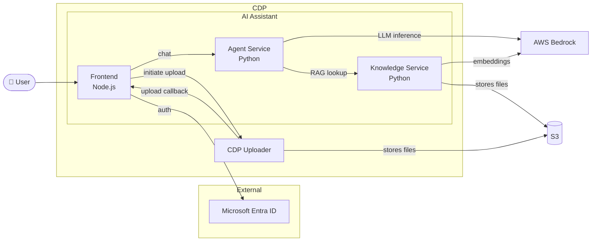

---

## GenAI Conversation Flow

All application functionality is driven by the conversation between the user and the AI. A user submits a prompt via the frontend, which is routed to the Agent Service for processing. The Agent Service determines whether the query requires a RAG lookup against the knowledge base, then constructs an appropriate request to AWS Bedrock.

### RAG Lookup Flow

The RAG implementation performs a vector similarity search using an embedding of the user's prompt. This is an intentionally straightforward implementation — nearest-neighbour lookup with no re-ranking or query expansion.

- **RAG path:** `knowledge_group_ids` present → embed prompt → pgvector similarity search → send prompt + matched chunks to Bedrock
- **No-RAG path:** no `knowledge_group_ids` → send prompt directly to Bedrock (LLM general knowledge only)

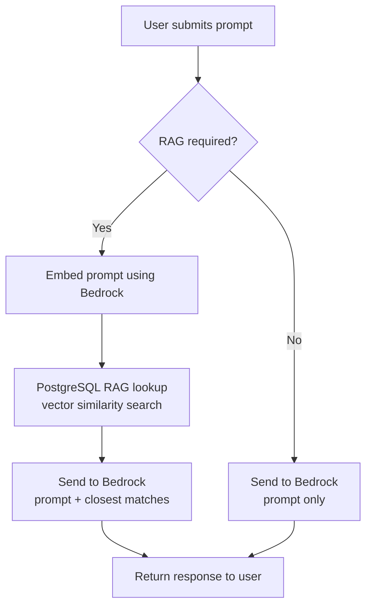

### RAG Lookup Sequence

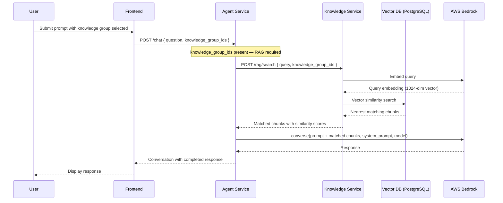

### Async GenAI Requests

LLM inference via AWS Bedrock introduces latency that is incompatible with a synchronous request-response model. The frontend implements an asynchronous polling pattern: an initial request queues the message and returns a conversation identifier immediately, while the frontend polls for completion.

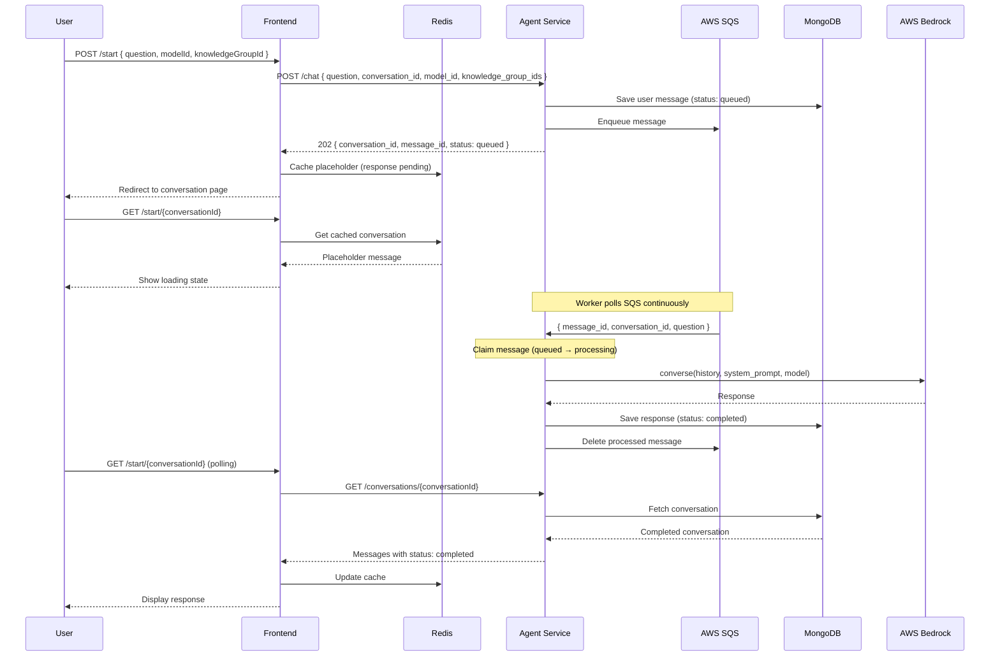

---

## Knowledge Upload and Ingestion

Document ingestion begins when the CDP Uploader delivers a file to S3 and fires a callback to the Frontend Service. The Frontend Service notifies the Knowledge Service, which takes responsibility for the remainder of the pipeline.

**Chunking:** 800 characters per chunk, 100 character overlap. JSONL = each line is a pre-formed chunk.

### High Level Ingest Journey

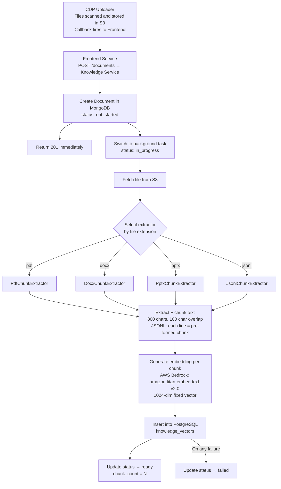

### Create Upload

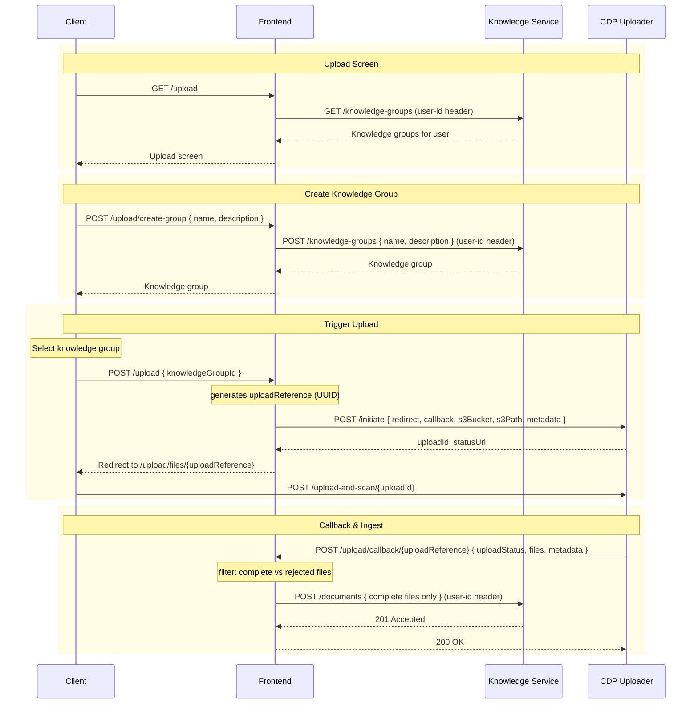

### Upload Complete

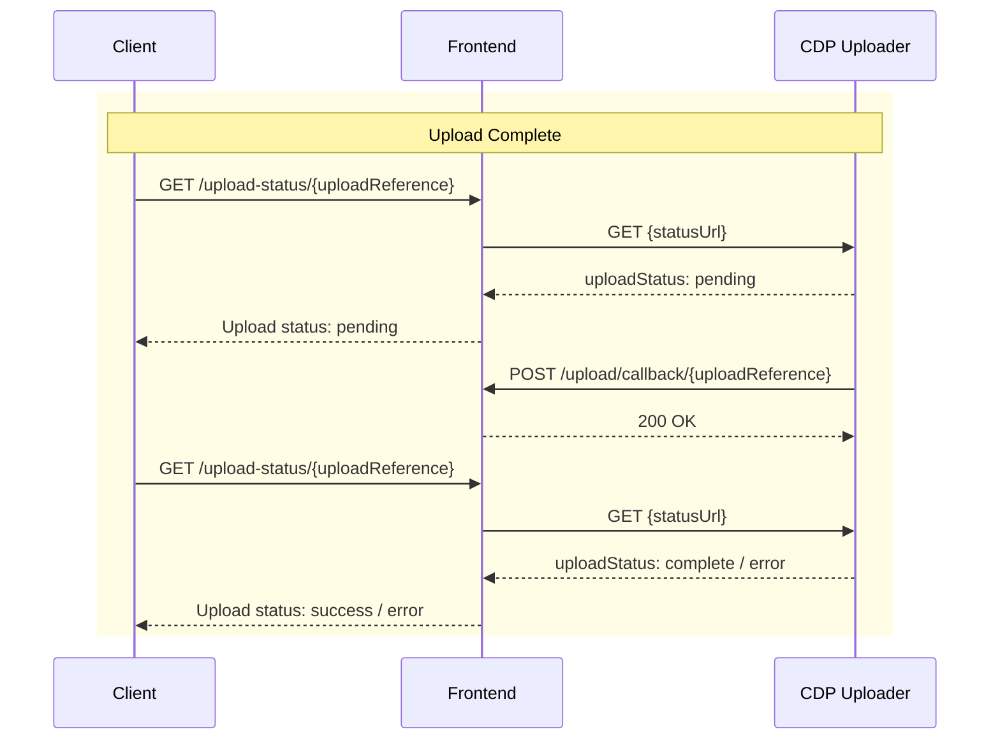

### Trigger Ingest

Ingestion runs as a background task per document using `asyncio.create_task()`. Status progression: `not_started → in_progress → ready / failed`.

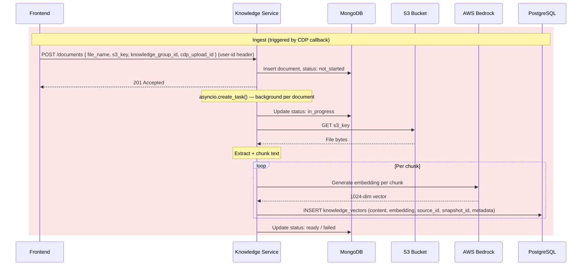

### Submit Prompt / RAG Lookup

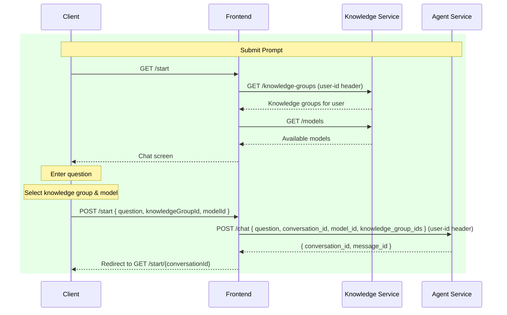

---

## Persistence

The Agent Service owns conversation and message state; the Knowledge Service owns document metadata and vector embeddings.

See [Data Models](Developer-Data-Models) for full field reference.

### Agent Service Data Model

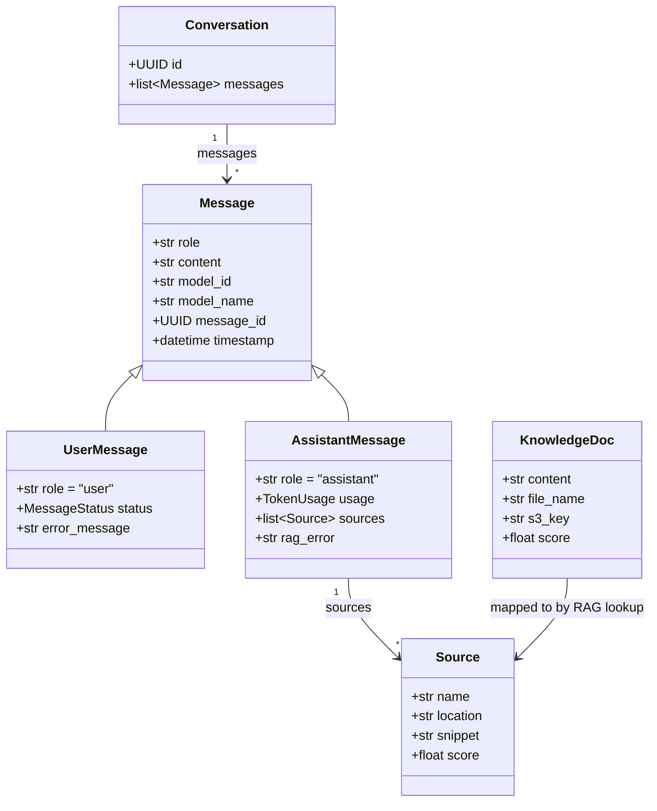

### Knowledge Service Data Model

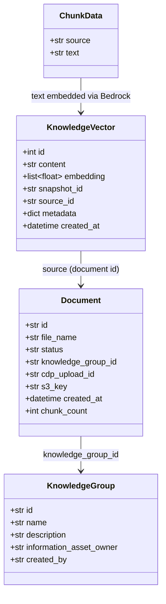
