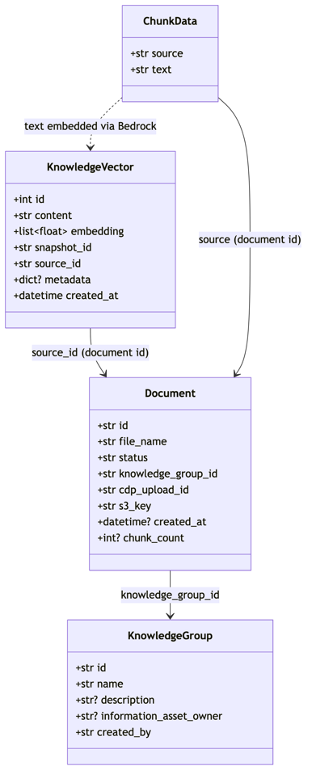

# Data Models

> 👩‍💻 **Developer Docs** — [Home](Home) › [Developer Docs](Home#developer-docs)

> **Source:** ADR-004 — AI Assistant Architecture

---

## Agent Service Data Model

The Agent service owns all conversation and message state, stored in MongoDB.

### Conversation

| Field | Type | Description |
|---|---|---|
| `id` | UUID | Unique conversation identifier |
| `messages` | list\<Message\> | Ordered list of messages |

### Message (base)

| Field | Type | Description |
|---|---|---|
| `role` | str | `"user"` or `"assistant"` |
| `content` | str | Message text |
| `model_id` | str | AWS Bedrock model identifier |
| `model_name` | str | Human-readable model name |
| `message_id` | UUID | Unique message identifier |
| `timestamp` | datetime | ISO 8601 creation time |

### UserMessage (extends Message)

| Field | Type | Description |
|---|---|---|
| `role` | str | Always `"user"` |
| `status` | MessageStatus | Processing state |
| `error_message` | str? | Error detail if processing failed |

### AssistantMessage (extends Message)

| Field | Type | Description |
|---|---|---|
| `role` | str | Always `"assistant"` |
| `usage` | TokenUsage | Token consumption |
| `sources` | list\<Source\> | Document chunks used in RAG (empty if no RAG) |
| `rag_error` | str? | Error detail if RAG lookup failed |

### KnowledgeDoc

Attached to AssistantMessage when RAG was performed.

| Field | Type | Description |
|---|---|---|
| `content` | str | Retrieved content |
| `file_name` | str | Source document filename |
| `s3_key` | str | S3 object key |
| `score` | float | Similarity score from pgvector |

### Source

Each entry is a document chunk that contributed to the response.

| Field | Type | Description |
|---|---|---|
| `name` | str | Document name |
| `location` | str | Location reference within the document |
| `snippet` | str | The text passage retrieved |
| `score` | float | Similarity score |

---

## Knowledge Service Data Model

The Knowledge service owns document metadata (MongoDB) and vector embeddings (PostgreSQL pgvector).

### KnowledgeGroup

| Field | Type | Description |
|---|---|---|
| `id` | str | Unique identifier |
| `name` | str | User-facing group name |
| `description` | str? | Optional description |
| `information_asset_owner` | str? | Owner of the information asset |
| `created_by` | str? | User who created the group |

### Document

| Field | Type | Description |
|---|---|---|
| `id` | str | Unique document identifier |
| `file_name` | str | Original uploaded filename |
| `status` | str | `not_started` · `in_progress` · `ready` · `failed` |
| `knowledge_group_id` | str | Parent knowledge group |
| `cdp_upload_id` | str | Reference from CDP Uploader |
| `s3_key` | str | S3 object key |
| `created_at` | datetime? | Ingestion start timestamp |
| `chunk_count` | int? | Number of chunks stored after ingestion |

### KnowledgeVector

One row per document chunk in PostgreSQL (pgvector).

| Field | Type | Description |
|---|---|---|
| `id` | int | Auto-generated primary key |
| `content` | str | Raw chunk text |
| `embedding` | list\<float\> | Titan Embed v2 vector (1024 dimensions) |
| `snapshot_id` | str | Ingestion batch reference |
| `source_id` | str | Foreign key → Document |
| `metadata` | dict? | Additional chunk metadata |
| `created_at` | datetime | Ingestion timestamp |

### ChunkData (internal)

Used during ingestion before vectors are stored. Embedded via `amazon.titan-embed-text-v2:0`.

| Field | Type | Description |
|---|---|---|
| `source` | str | Source document reference |
| `text` | str | Raw chunk text (800 chars, 100 char overlap; JSONL = one chunk per line) |
