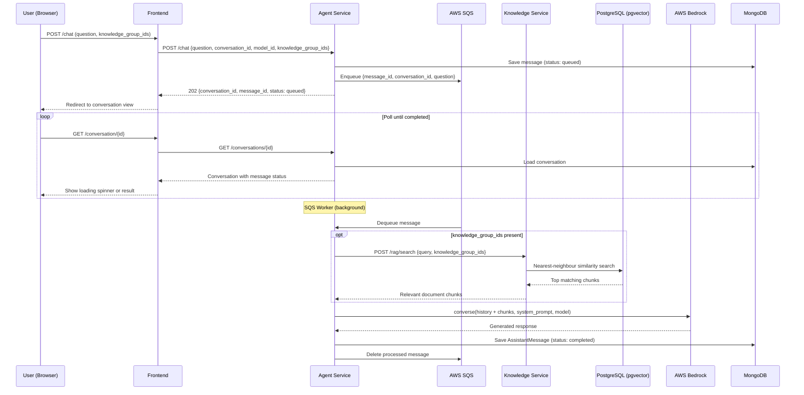
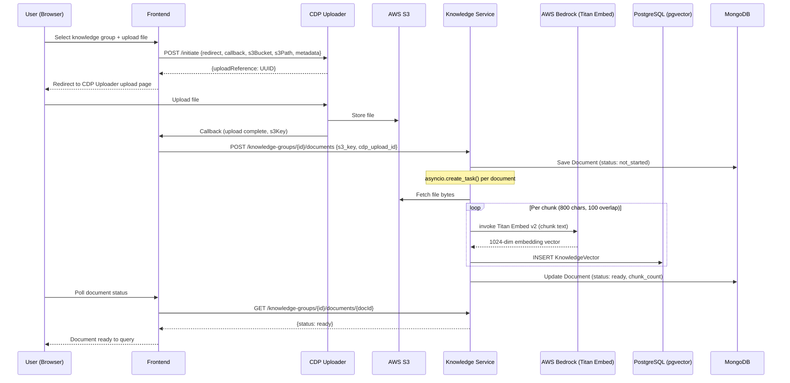
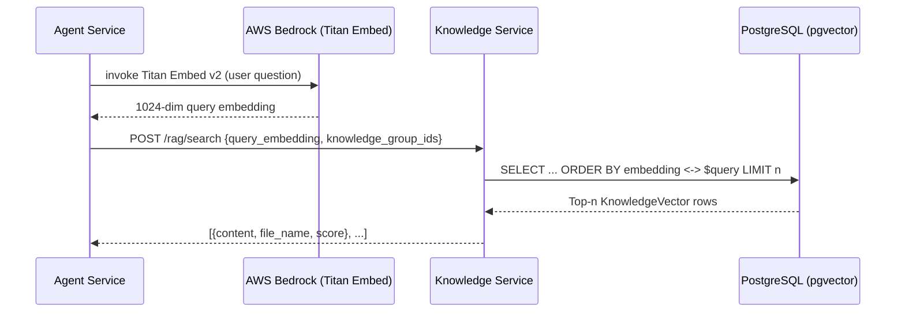

# Service Interactions

[← Back to Integration & Deployment](README.md)

---

## 1. Chat Flow (Async Queue-and-Poll)

---

## 2. Document Upload Flow

---

## 3. RAG Search (Agent → Knowledge — Internal)

---

## API Key Flow

| Caller | Called Service | Headers |
|---|---|---|
| Frontend | Agent Service | `X-API-KEY` + `user-id` |
| Frontend | Knowledge Service | `X-API-KEY` + `user-id` |
| Agent Service | Knowledge Service | `X-API-KEY` |
| All services | AWS | IAM Role (prod) / LocalStack dummy creds (local) |
