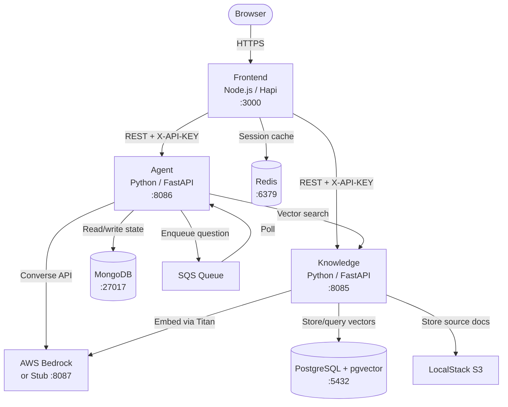
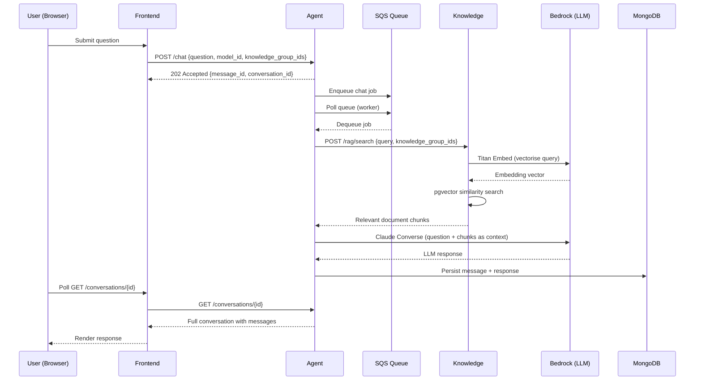

# Architecture

> **Source:** `ai-defra-search-core/ARCHITECTURE.md`, `ai-defra-search-core/compose.yml`, repo analysis

---

## System Overview

AI DEFRA Search is a microservices application built around a Retrieval-Augmented Generation (RAG) pattern. Users interact with a browser-based frontend; questions are queued and processed asynchronously by an Agent service that retrieves relevant document chunks from a Knowledge service and sends them to a large language model (LLM) via AWS Bedrock.

---

## Services

### Frontend (`ai-defra-search-frontend`)

- **Stack:** Node.js 22+, Hapi framework, Nunjucks templates, Webpack, SCSS
- **Port:** 3000 (must be accessed via `frontend.localhost` through Traefik in full-stack mode)
- **Responsibilities:** Render chat UI, manage user sessions, proxy requests to Agent and Knowledge APIs, handle file uploads via CDP uploader, cache conversation data in Redis
- **Key external dependencies:** Agent API, Knowledge API, Redis (session cache), CDP uploader service

### Agent (`ai-defra-search-agent`)

- **Stack:** Python 3.12+, FastAPI, Motor (async MongoDB), boto3, Anthropic SDK
- **Port:** 8086
- **Responsibilities:** Receive chat requests, enqueue them to SQS, poll and process the queue, retrieve context from Knowledge service, call AWS Bedrock for LLM responses, persist conversation history in MongoDB
- **Chat flow:** `POST /chat` → 202 Accepted → SQS enqueue → Worker polls SQS → Knowledge query → Bedrock invoke → MongoDB write → available on `GET /conversations/{id}`

### Knowledge (`ai-defra-search-knowledge`)

- **Stack:** Python 3.13+, FastAPI, SQLAlchemy (async), pgvector, boto3, PyMuPDF, python-docx, python-pptx
- **Port:** 8085
- **Responsibilities:** Accept document uploads, extract and chunk text, generate vector embeddings via AWS Bedrock Titan, store vectors in PostgreSQL/pgvector, serve semantic search results to the Agent
- **Supported document types:** PDF, DOCX, PPTX, JSONL

### AWS Bedrock Stub (`ai-defra-search-aws-bedrock-stub`)

- **Stack:** WireMock
- **Port:** 8087
- **Responsibilities:** Stub the AWS Bedrock Claude Converse API and Titan Embed API so the full stack can run locally without AWS credentials

---

## Infrastructure Components

| Component | Version | Role |
|---|---|---|
| PostgreSQL + pgvector | Custom Dockerfile | Vector store for document embeddings |
| MongoDB | 6.0.13 | Conversation history and state |
| Redis | 7.2.3 | Frontend session and response cache |
| LocalStack | 4.9.2 | Local AWS emulation (S3, SQS, SNS, Firehose) |
| Traefik | v3 | Reverse proxy and service routing |

---

## Network

All services communicate over an isolated Docker bridge network (`ai-defra-search` in core, `cdp-tenant` per-service). Traefik handles routing from the host and provides service discovery.

---

## Data Flow: Chat Request (End to End)

---

## Authentication

All Agent and Knowledge API endpoints (except `/health` and `/docs`) require an `X-API-KEY` header. The Frontend holds the key and injects it on every backend call. Missing key returns 401; incorrect key returns 403.
