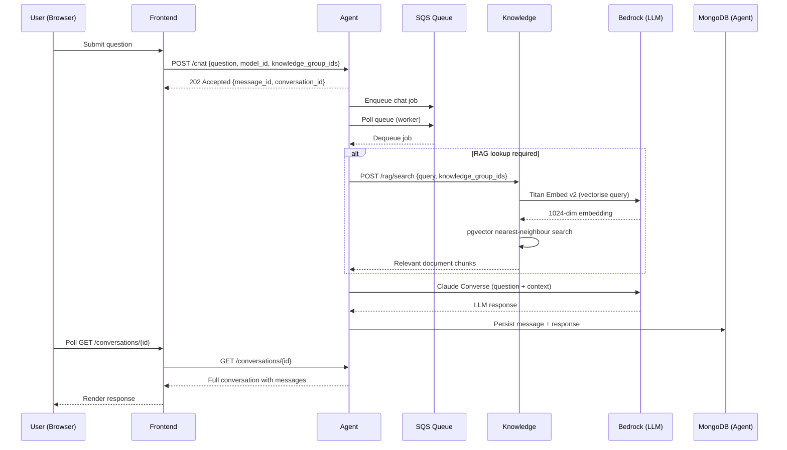
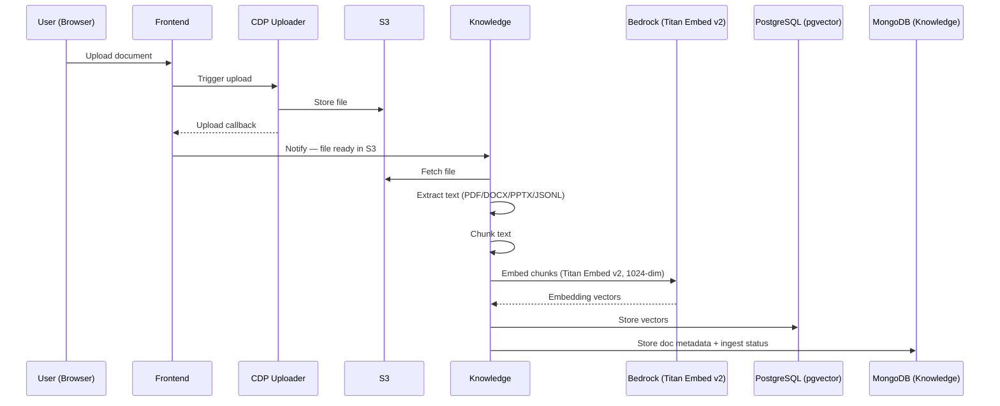

# Architecture

> **Source:** `ADR-004 - AI Assistant Architecture`, `ai-defra-search-core/compose.yml`, repo analysis

---

## System Overview

AI DEFRA Search is a reference implementation of a Retrieval-Augmented Generation (RAG) assistant built for DEFRA's Core Delivery Platform (CDP). Users interact with a browser-based frontend; questions are queued and processed asynchronously by an Agent service that — where appropriate — retrieves relevant document chunks from a Knowledge service before calling a large language model (LLM) via AWS Bedrock.

The system prompts have not been extensively optimised. The data structures reflect a generalised design intended as an architectural baseline for teams to adapt.

```mermaid
graph TD
    User([Browser])
    FE[Frontend\nNode.js / Hapi\n:3000]
    AG[Agent\nPython / FastAPI\n:8086]
    KN[Knowledge\nPython / FastAPI\n:8085]
    BK[AWS Bedrock\nor Stub :8087]
    MGA[(MongoDB — Agent\nconversations & messages)]
    MGK[(MongoDB — Knowledge\ndoc metadata & ingest status)]
    PG[(PostgreSQL + pgvector\nvector embeddings)]
    RD[(Redis\nsession cache)]
    SQ[SQS Queue]
    S3[S3\ndocument storage]
    CDP[CDP Uploader]
    Entra[Microsoft Entra ID\nauth]

    User -->|HTTPS| FE
    FE -->|OAuth 2.0| Entra
    FE -->|REST + X-API-KEY| AG
    FE -->|REST + X-API-KEY| KN
    FE -->|Upload trigger| CDP
    CDP -->|File stored| S3
    CDP -->|Upload callback| FE
    FE -->|Notify| KN
    KN -->|Fetch file| S3
    AG -->|Enqueue question| SQ
    SQ -->|Poll| AG
    AG -->|RAG search (if needed)| KN
    AG -->|Converse API| BK
    KN -->|Titan Embed v2| BK
    AG -->|Conversation state| MGA
    KN -->|Doc metadata + ingest status| MGK
    KN -->|Store/query vectors| PG
    FE -->|Session cache| RD
```

---

## Services

### Frontend (`ai-defra-search-frontend`)

- **Stack:** Node.js 22+, Hapi framework, Nunjucks templates, Webpack, SCSS
- **Port:** 3000 (accessed via `frontend.localhost` through Traefik in full-stack mode)
- **Responsibilities:**
  - Render chat UI, knowledge group management, and file upload screens
  - Authenticate users via **Microsoft Entra ID** (OAuth 2.0)
  - Cache conversation data in Redis
  - Trigger document upload via the **CDP Uploader** service
  - Receive the CDP upload callback once the file is in S3, then notify the Knowledge service to begin ingestion

### Agent (`ai-defra-search-agent`)

- **Stack:** Python 3.12+, FastAPI, Motor (async MongoDB), boto3, Anthropic SDK
- **Port:** 8086
- **Responsibilities:**
  - Accept chat requests from the Frontend and enqueue them to SQS
  - Poll SQS and process queued jobs
  - **Determine whether a RAG lookup is required** — not all queries are routed to the Knowledge service
  - Where RAG is needed, retrieve relevant document chunks from the Knowledge service
  - Call AWS Bedrock (Claude) for LLM responses
  - Persist conversation history and message state in **MongoDB**

### Knowledge (`ai-defra-search-knowledge`)

- **Stack:** Python 3.13+, FastAPI, SQLAlchemy (async), pgvector, boto3, PyMuPDF, python-docx, python-pptx
- **Port:** 8085
- **Responsibilities:**
  - Fetch uploaded documents from S3 following a Frontend notification
  - Extract and chunk document text (PDF, DOCX, PPTX, JSONL)
  - Generate 1024-dimensional vector embeddings using **AWS Bedrock Titan Embed v2**
  - Store embeddings in PostgreSQL/pgvector for semantic search
  - Store document metadata and ingestion status in **MongoDB**
  - Serve vector similarity search results to the Agent

### AWS Bedrock Stub (`ai-defra-search-aws-bedrock-stub`)

- **Stack:** WireMock — **Port:** 8087
- Stubs the Claude Converse API and Titan Embed v2 API for local development without AWS credentials

---

## Infrastructure Components

| Component | Version | Role |
|---|---|---|
| PostgreSQL + pgvector | Custom Dockerfile | Vector store for 1024-dim Titan Embed v2 embeddings |
| MongoDB | 6.0.13 | Agent: conversation/message state · Knowledge: doc metadata & ingest status |
| Redis | 7.2.3 | Frontend session and conversation cache |
| LocalStack | 4.9.2 | Local AWS emulation (S3, SQS, SNS, Firehose) |
| Traefik | v3 | Reverse proxy and service routing |
| Microsoft Entra ID | Managed | User authentication (OAuth 2.0) |
| CDP Uploader | DEFRA managed | Handles file upload to S3, fires callback to Frontend |

---

## Network

All services communicate over an isolated Docker bridge network (`ai-defra-search` in core, `cdp-tenant` per-service). Traefik handles routing from the host.

---

## Data Flow: Chat Request (End to End)



---

## Data Flow: Document Upload and Ingestion



---

## RAG Implementation Notes

The current RAG implementation is an intentionally straightforward baseline:

- **Search method:** Nearest-neighbour vector similarity search (cosine) via pgvector
- **Embedding model:** AWS Bedrock Titan Embed v2, 1024 dimensions
- **No re-ranking or query expansion** — results are returned as-is from the similarity search
- **Similarity threshold:** Configurable (default 0.5) — chunks below this score are excluded
- **RAG is conditional** — the Agent determines per-request whether a knowledge lookup is needed

Teams extending this system should find the service boundaries straightforward to adapt for more sophisticated retrieval strategies (metadata filtering, hybrid search, re-ranking).

---

## Authentication

| Layer | Mechanism |
|---|---|
| User → Frontend | Microsoft Entra ID (OAuth 2.0) |
| Frontend → Agent API | `X-API-KEY` header |
| Frontend → Knowledge API | `X-API-KEY` header |
| Services → AWS | IAM role (production) / LocalStack (local dev) |
