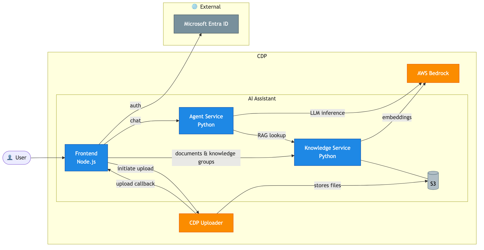
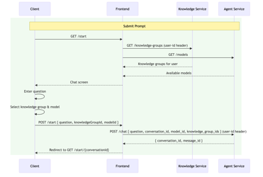
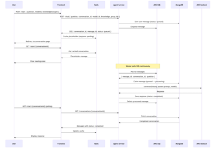
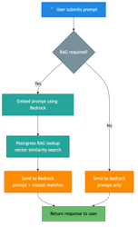
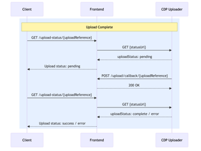
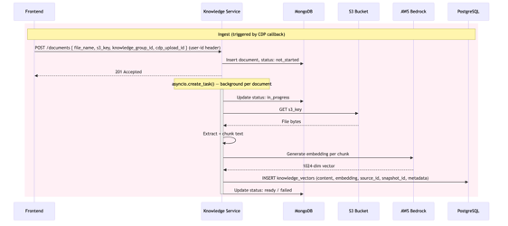

# Architecture

> **Source:** ADR-004 — AI Assistant Architecture (Confluence), repo analysis

---

## System Overview

AI DEFRA Search is a reference implementation of a Retrieval-Augmented Generation (RAG) assistant built for DEFRA's Core Delivery Platform (CDP). The system prompts have not been extensively optimised and the data structures reflect a generalised design — teams should treat this as an architectural baseline to adapt.

The system runs entirely within CDP. Microsoft Entra ID provides user authentication externally. AWS Bedrock (for LLM inference and embeddings) and S3 sit within the CDP boundary. The CDP Uploader handles file ingestion separately from the main AI Assistant services.

---

## Services

### Frontend (`ai-defra-search-frontend`) — Node.js + Redis

- **Port:** 3000 (accessed via `frontend.localhost` through Traefik)
- Renders chat UI, knowledge group management, and file upload screens
- Authenticates users via **Microsoft Entra ID** (OAuth 2.0)
- Caches conversation data short-term in **Redis**
- Initiates document upload via the **CDP Uploader**; receives the upload callback and notifies the Knowledge service
- On chat submission: calls Knowledge service for available groups, calls Agent for available models, then POSTs the chat request to Agent

### Agent Service (`ai-defra-search-agent`) — Python

- **Port:** 8086
- Receives chat requests from the Frontend and enqueues them to **AWS SQS**
- Returns a placeholder message and `conversation_id` immediately (202); the Frontend polls for completion
- Worker polls SQS, determines whether a **RAG lookup is required**, calls Knowledge service if so, then calls **AWS Bedrock** (Claude) for the LLM response
- Persists conversation history and message state in **MongoDB**

### Knowledge Service (`ai-defra-search-knowledge`) — Python

- **Port:** 8085
- Receives document notifications from the Frontend after CDP upload completes
- Runs ingestion as a background task: fetches from S3, extracts text, chunks, generates **1024-dim Titan Embed v2** vectors via Bedrock, stores in **PostgreSQL/pgvector**
- Stores document metadata and ingestion status in **MongoDB**
- Serves vector similarity search results to the Agent on request

### AWS Bedrock Stub (`ai-defra-search-aws-bedrock-stub`) — WireMock

- **Port:** 8087 — stubs Claude Converse and Titan Embed v2 for local development

---

## Infrastructure

| Component | Version | Role |
|---|---|---|
| PostgreSQL + pgvector | Custom Dockerfile | 1024-dim vector storage and nearest-neighbour search |
| MongoDB | 6.0.13 | Agent: conversations & messages · Knowledge: document metadata & ingest status |
| Redis | 7.2.3 | Frontend short-term conversation cache |
| LocalStack | 4.9.2 | Local AWS emulation (S3, SQS, SNS, Firehose) |
| Traefik | v3 | Reverse proxy and service routing |
| Microsoft Entra ID | Managed | User authentication (OAuth 2.0) |
| CDP Uploader | DEFRA managed | Secure file-to-S3 upload with callback |

---

## Flow 1 — Chat Submission

When a user opens the chat screen, the Frontend fetches available knowledge groups and models. On submission:

1. Frontend `POST /start { question, knowledgeGroupId, modelId }` to itself
2. Frontend `POST /chat { question, conversation_id, model_id, knowledge_group_ids }` to Agent (with `user-id` header)
3. Agent returns `{ conversation_id, message_id }` immediately
4. Frontend redirects to `GET /start/{}/conversations/{id}` — polling begins

---

## Flow 2 — Full Conversation Processing

After the chat is submitted, the Agent handles the response asynchronously:

1. Frontend POSTs to Agent; Agent saves message with `status: queued`, enqueues to SQS, returns placeholder
2. Frontend shows a loading state while polling `GET /conversations/{conversationId}`
3. SQS worker dequeues `{ conversation_id, message_id, context_id }`
4. Worker conditionally calls Knowledge service (RAG lookup), generates response via Bedrock, persists to MongoDB, deletes the SQS message
5. On next poll, the Frontend receives the completed message and updates the cache

---

## Flow 3 — RAG Decision

The Agent decides per-request whether RAG is required:

- **RAG path:** Embed prompt via Bedrock → pgvector similarity search → send prompt + closest matches to Bedrock
- **No-RAG path:** Send prompt directly to Bedrock (LLM general knowledge only)

The decision is based on whether `knowledge_group_ids` are present in the request. The current implementation is a straightforward nearest-neighbour lookup — no re-ranking or query expansion.

---

## Flow 4 — Document Upload (CDP Callback)

The CDP Uploader handles secure file transfer to S3 independently:

1. Frontend triggers upload; polls `GET /upload-status/{uploadReference}`
2. CDP Uploader stores file in S3 and `POST /upload/callback/{uploadReference}` back to Frontend
3. Frontend polls status URL; receives `uploadStatus: complete / error`
4. On completion, Frontend notifies Knowledge service to begin ingestion

---

## Flow 5 — Document Ingestion

Ingestion runs as a background task in the Knowledge service:

1. Frontend `POST /documents { file_name, s3_key, knowledge_group_id, cdp_upload_id }` (with `user-id` header)
2. Knowledge service returns `201 Accepted`; inserts document record with `status: not_started`
3. `asyncio.create_task()` spawns a background task per document
4. Task: `status → in_progress` → `GET s3_key` (fetch file bytes) → extract + chunk text → generate 1024-dim embedding per chunk via Bedrock → `INSERT knowledge_vectors (content, embedding, source_id, snapshot_id, metadata)` → `status → ready / failed`

---

## Authentication

| Layer | Mechanism |
|---|---|
| User → Frontend | Microsoft Entra ID (OAuth 2.0) |
| Frontend → Agent API | `X-API-KEY` header |
| Frontend → Knowledge API | `X-API-KEY` header + `user-id` header |
| Services → AWS | IAM role (production) / LocalStack (local dev) |

---

## Data Models

See [DATA-MODELS.md](DATA-MODELS.md) for full data model diagrams and field reference.
