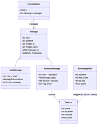
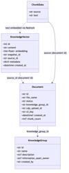

# Data Models

> **Source:** ADR-004 — AI Assistant Architecture (Confluence)

---

## Agent Service Data Model

The Agent service owns all conversation and message state.

### Conversation

| Field | Type | Description |
|---|---|---|
| `id` | UUID | Unique conversation identifier |
| `messages` | Message[] | Ordered list of messages in this conversation |

### Message (base)

| Field | Type | Description |
|---|---|---|
| `role` | str | `"user"` or `"assistant"` |
| `content` | str | Message text |
| `model_id` | str | Model used to generate the response |
| `model_name` | str | Human-readable model name |
| `status` | str | `queued` · `in_progress` · `completed` · `error` |
| `timestamp` | datetime | ISO 8601 creation time |

### UserMessage (extends Message)

| Field | Type | Description |
|---|---|---|
| `role` | str | Always `"user"` |
| `status` | StatusFailureMessage | Failure state if the message could not be processed |
| `error_message` | str | Error detail when status indicates failure |

### AssistantMessage (extends Message)

| Field | Type | Description |
|---|---|---|
| `role` | str | Always `"assistant"` |
| `usage` | TokenUsage | Token consumption for this response |
| `sources` | Source[] | Document chunks used in RAG lookup (empty if no RAG) |

### Source

Populated when the Agent performed a RAG lookup. Each entry is a document chunk that contributed to the response.

| Field | Type | Description |
|---|---|---|
| `name` | str | Document name |
| `location` | str | Location reference within the document |
| `snippet` | str | The text passage that was retrieved |
| `score` | float | Similarity score from pgvector search |

---

## Knowledge Service Data Model

The Knowledge service owns all document metadata, ingestion state, and vector embeddings.

### KnowledgeGroup

| Field | Type | Description |
|---|---|---|
| `id` | str | Unique identifier |
| `name` | str | User-facing group name |
| `description` | str | Optional description |
| `retrieval_prompt_server` | str | Server-side prompt used during RAG retrieval for this group |
| `created_at` | str | ISO 8601 creation timestamp |

### Document

| Field | Type | Description |
|---|---|---|
| `file_name` | str | Original uploaded filename |
| `status` | str | `not_started` · `in_progress` · `ready` · `failed` |
| `s3_key` | str | S3 object key for the source file |
| `knowledge_group_id` | str | Parent knowledge group |
| `cdp_upload_id` | str | Reference from the CDP Uploader |
| `ref_chunk_count` | str | Expected number of chunks |
| `final_count` | str | Actual number of chunks successfully stored |

### KnowledgeVector

Stored in PostgreSQL with the pgvector extension. One row per document chunk.

| Field | Type | Description |
|---|---|---|
| `id` | — | Auto-generated primary key |
| `name` | str | Chunk identifier / label |
| `type` | str | Chunk type classification |
| `embedding` | vector(1024) | Titan Embed v2 embedding (1024 dimensions) |
| `metadata` | — | Additional chunk metadata |
| `created_at` | date | Ingestion timestamp |
| `source_id` | — | Foreign key → Document |

### ChunkData (internal processing)

Used during the ingestion pipeline before vectors are stored.

| Field | Type | Description |
|---|---|---|
| `source` | str | Source document reference |
| `text` | str | Raw chunk text |
| `text_embedding_via_factory` | list | Embedding vector generated by Bedrock Titan Embed v2 |
