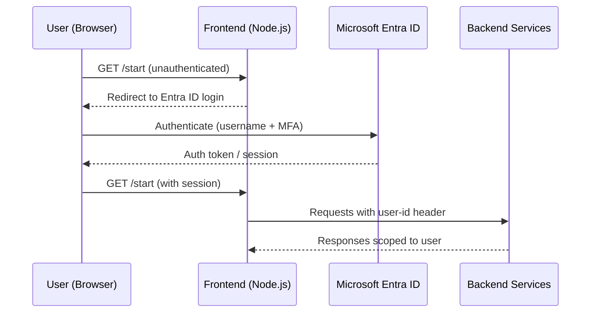

# Authentication & Authorisation

[Back to Developer Docs](../README.md)

---

## Overview

Authentication is handled by **Microsoft Entra ID (Azure AD)** via the Frontend Service. Internal service-to-service calls rely on a `user-id` HTTP header propagated from the Frontend.

---

## Authentication Flow

---

## User Identity Propagation

Once authenticated, the Frontend extracts the user identity from the Entra ID session and forwards it as a `user-id` HTTP header on all calls to the Agent Service and Knowledge Service.

| Header | Description |
|---|---|
| `user-id` | Authenticated user identifier — used to scope knowledge groups and documents |

Backend services **do not authenticate requests directly**; they trust the `user-id` header forwarded by the Frontend. This means the Frontend acts as the authentication boundary — backend services must not be exposed directly to the internet.

> **Warning: Assumed** — the exact header name and session mechanism should be verified in the Frontend source (`src/`). CDP may enforce additional controls at the platform level.

---

## Rate Limiting

> **Warning: Could not determine** — no explicit rate limiting configuration was identified in the available documentation. AWS Bedrock applies its own throughput limits per model. Recommend checking CDP platform-level rate limiting and Bedrock quota settings for production deployments.

---

## Local Development

For local development without Entra ID:

- The Frontend may support a local stub or bypass mode — check `.example.env` for `AUTH_*` variables
- The Bedrock stub (`ai-defra-search-aws-bedrock-stub`) requires no AWS credentials

---

## Security Scanning

All repos include **Trivy** for vulnerability scanning and **SonarCloud** for static code analysis, integrated into GitHub Actions CI/CD pipelines.
