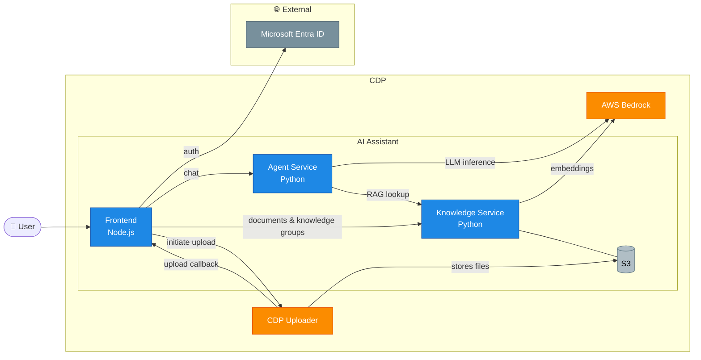
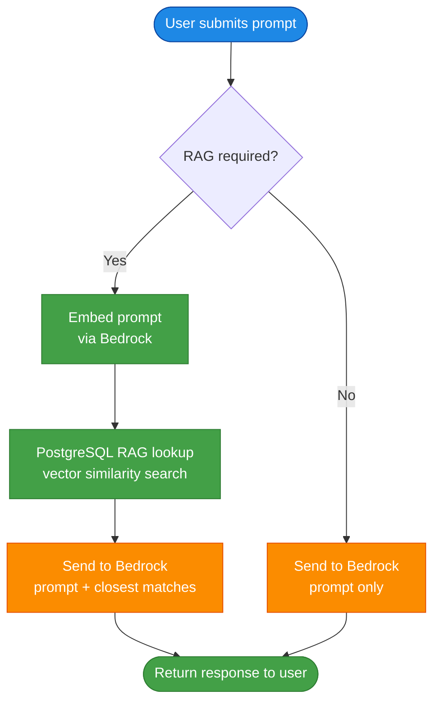
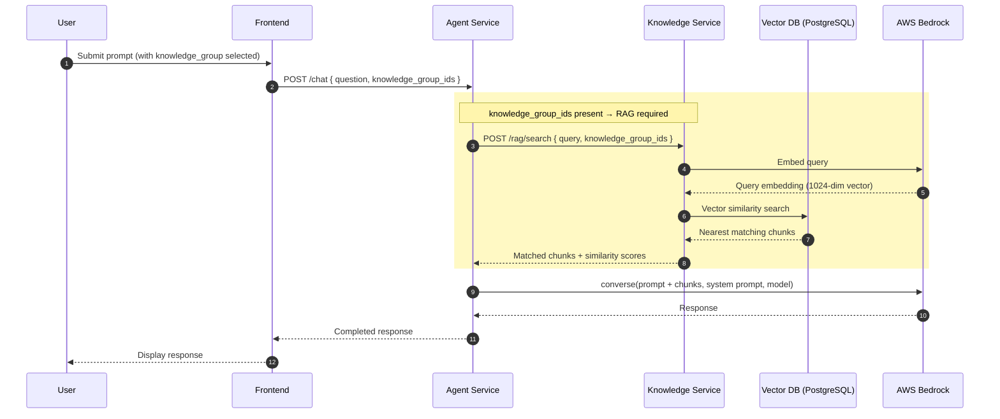
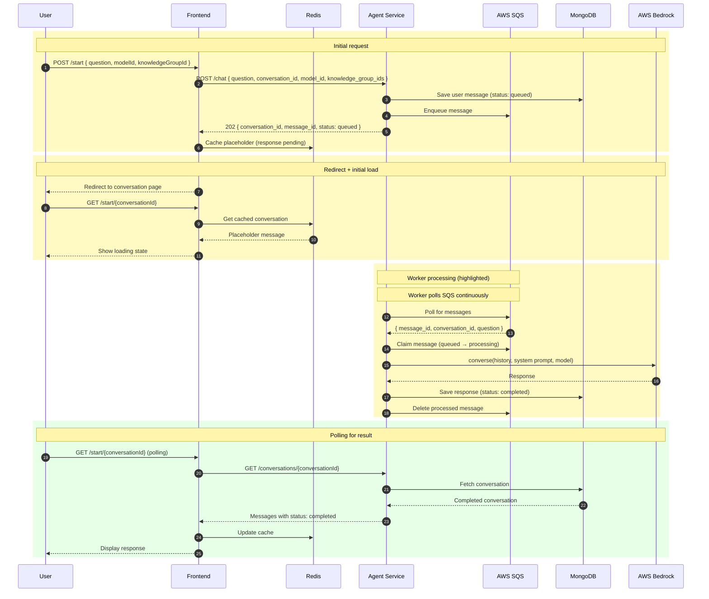
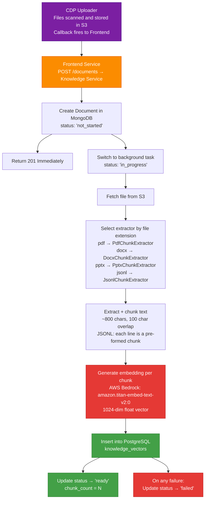
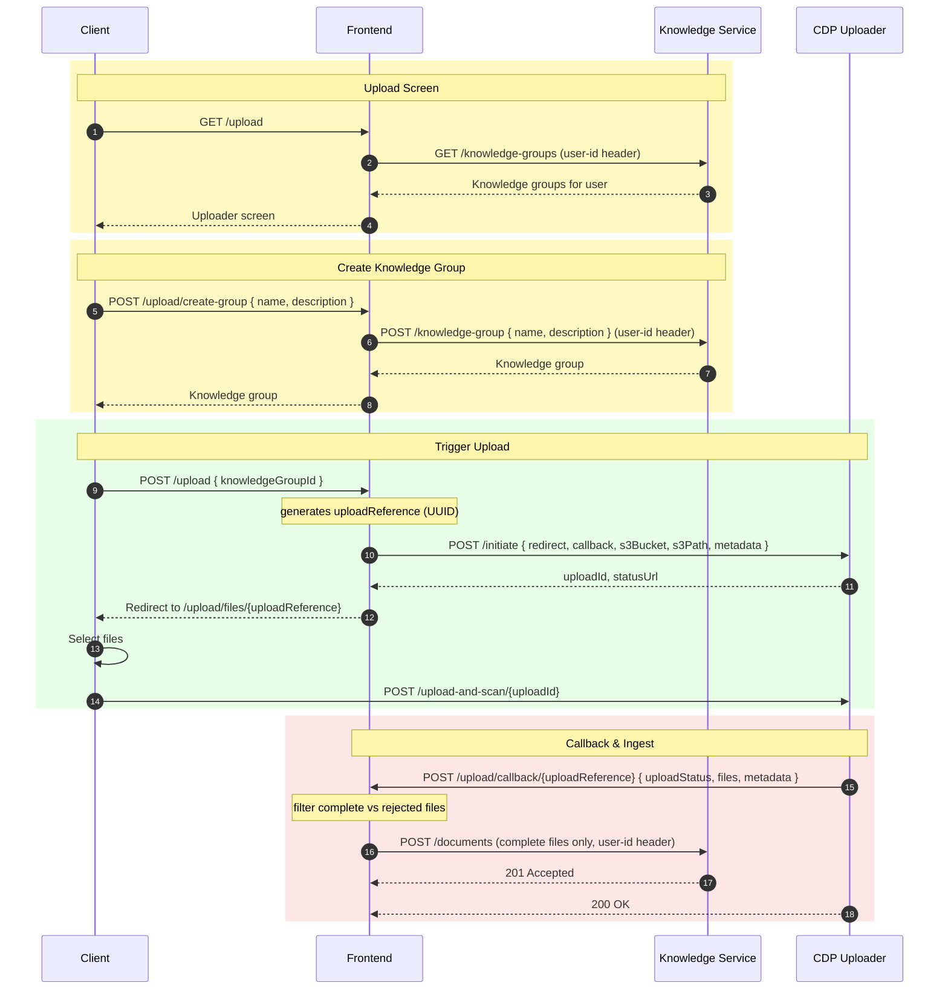
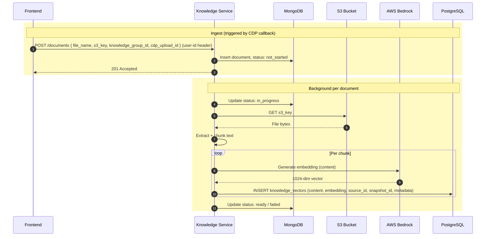

# Architecture

[Back to Developer Docs](./README.md)

---

## Overview

AI DEFRA Search is a three-tier RAG assistant deployed on DEFRA's Core Delivery Platform (CDP). All AI inference and embedding is delegated to AWS Bedrock. Authentication is handled by Microsoft Entra ID (Azure AD).

---

## 1. High-Level Service Topology

*Source: ADR-004, Figure 1 — High Level Architecture*

---

## 2. GenAI Conversation Flow

All application functionality is driven by the conversation between the user and the AI. A user submits a prompt via the frontend, which is routed to the Agent Service. The Agent determines whether a RAG lookup is required, constructs a Bedrock request, and persists the result in MongoDB.

### RAG Decision Flow

*Source: ADR-004, Figure 2 — RAG Flow*

---

## 3. RAG Lookup — Sequence Diagram

The RAG implementation performs a nearest-neighbour vector similarity search against the knowledge base. This is an intentionally simple baseline — no re-ranking or query expansion is applied.

*Source: ADR-004, RAG Lookup Flow Mermaid Code*

---

## 4. Async Conversation — Loading Spinner Pattern

LLM inference via AWS Bedrock introduces latency incompatible with a synchronous request-response model. The frontend implements an async polling pattern: the initial request queues the message and returns a conversation identifier immediately; the frontend then polls for completion.

*Source: ADR-004, Loading Spinner for A-Sync GenAI Requests Mermaid Code*

---

## 5. Knowledge Upload and Ingestion

Document ingestion begins when the CDP Uploader delivers a file to S3 and fires a callback to the Frontend Service.

### High-Level Ingest Flow

*Source: ADR-004, High Level Ingest Journey diagram*

### Detailed Ingest — Create Upload Sequence

*Source: ADR-004, Create Upload sequence diagram*

### Detailed Ingest — Trigger Ingest Sequence

*Source: ADR-004, Trigger Ingest sequence diagram*

---

## 6. Persistence Layer

Two databases underpin the system. The Agent Service owns conversation state; the Knowledge Service owns document metadata and vector embeddings.

| Store | Service | Purpose |
|---|---|---|
| MongoDB | Agent Service | Conversation and message history, message status (queued / processing / completed) |
| MongoDB | Knowledge Service | Document metadata, ingest status, chunk counts |
| PostgreSQL (pgvector) | Knowledge Service | Vector embeddings for RAG retrieval |
| Redis | Frontend | Short-term conversation cache, session state |
| S3 | Knowledge Service | Uploaded document files |
