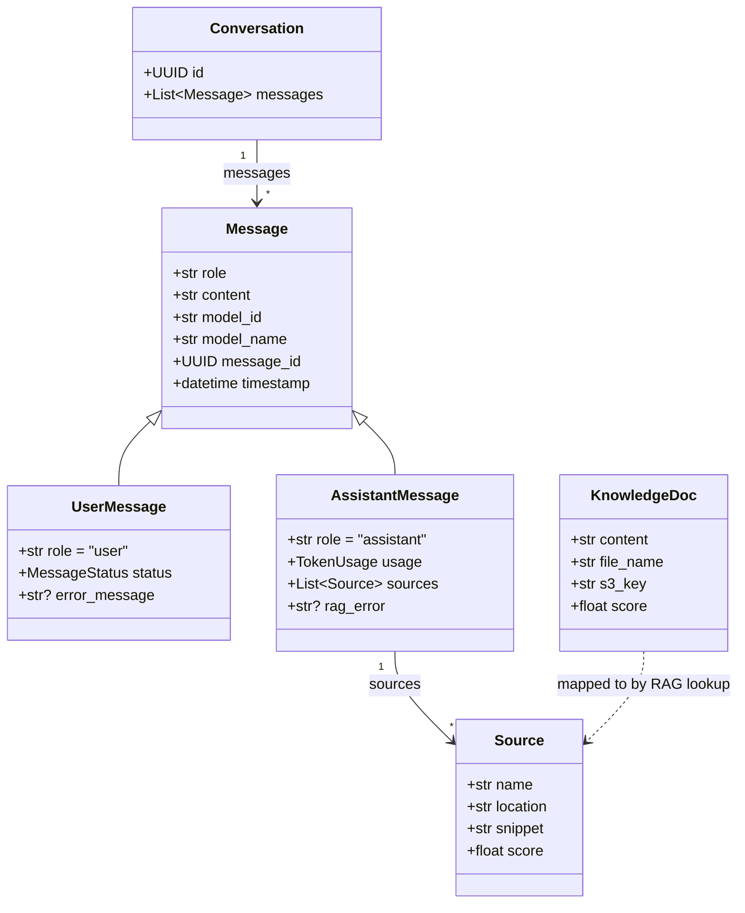
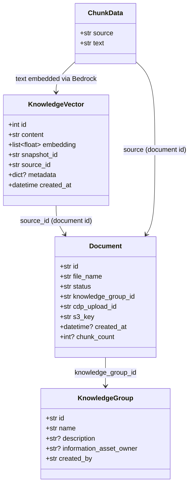

# Data Models

[Back to Developer Docs](./README.md)

---

## Agent Service Data Model

The Agent Service owns conversation and message state, stored in MongoDB.

*Source: ADR-004, Agent Service Data Model Mermaid Code*

**MessageStatus values:** `queued` | `processing` | `completed` | `failed`

---

## Knowledge Service Data Model

The Knowledge Service owns document metadata and vector embeddings, stored across MongoDB (document metadata) and PostgreSQL/pgvector (embeddings).

*Source: ADR-004, Knowledge Service Data Model*

**Document status values:** `not_started` | `in_progress` | `ready` | `failed`

---

## Storage Mapping

| Entity | Store | Notes |
|---|---|---|
| `Conversation`, `Message` | MongoDB (Agent Service) | Full conversation history with role, content, timestamps |
| `Document` (metadata) | MongoDB (Knowledge Service) | Ingest status, S3 key, chunk count |
| `KnowledgeGroup` | MongoDB (Knowledge Service) | User-owned, personal only |
| `KnowledgeVector` | PostgreSQL + pgvector | 1024-dim float vectors from Titan Embed v2 |
| Uploaded files | AWS S3 | Raw files, fetched by Knowledge Service during ingest |
| Session cache | Redis (Frontend) | Short-lived conversation placeholder during async processing |
