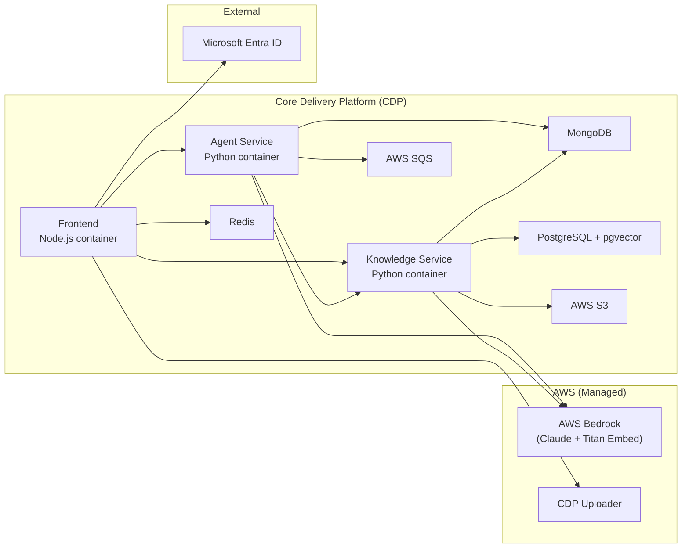

# Deployment

[Back to Developer Docs](./README.md)

---

## Platform

All services are deployed on **DEFRA's Core Delivery Platform (CDP)**. CDP provides managed container orchestration, secrets management, and infrastructure conventions that all services in this project follow.

---

## Environments

> **Warning: Assumed** — specific environment names (dev, test, prod) and URLs are not defined in the available documentation. Verify with the CDP platform team.

| Environment | Purpose |
|---|---|
| Local | Developer machine using Docker Compose + LocalStack + Bedrock stub |
| CDP Dev | Integration environment on CDP |
| CDP Production | Live production environment on CDP |

---

## Infrastructure Topology

---

## Containerisation

Each service ships with a `Dockerfile` and `compose.yml` for consistent local and deployed environments. The `compose/` directory contains environment-specific Compose overrides.

| File | Purpose |
|---|---|
| `Dockerfile` | Production container image |
| `compose.yml` | Base multi-service orchestration |
| `compose/` | Debug, test, and environment-specific overrides |

---

## Secrets Management

> **Warning: Assumed** — CDP manages secrets injection at the platform level. Services use environment variables; no hardcoded secrets should exist. The Knowledge Service uses `compose/aws.env` and `compose/secrets.env` files rather than `.env` to align with CDP conventions.

Sensitive variables include: MongoDB URI, AWS credentials (region, access key), SQS queue URL, PostgreSQL connection string.

---

## CI/CD

All repos use **GitHub Actions** for CI/CD. Typical pipeline:

1. Run linting (Ruff for Python, ESLint for Node.js)
2. Run unit/integration tests
3. Trivy vulnerability scan
4. SonarCloud static analysis
5. Build and push Docker image
6. Deploy to CDP environment
7. Run journey tests against deployed environment

---

## Database Migrations

The Knowledge Service includes a `migrator/` directory with database migration tooling for PostgreSQL schema management (creating the `knowledge_vectors` table with pgvector extension).

> **Warning: Assumed** — migration execution strategy (run-on-startup vs manual trigger) should be verified in the migrator code.

---

## Scaling Considerations

| Component | Scaling approach |
|---|---|
| Frontend | Horizontal — stateless with Redis session cache |
| Agent Service | Horizontal — SQS worker scales independently of API tier |
| Knowledge Service | Horizontal — background ingest tasks are independent |
| PostgreSQL | Vertical / managed CDP instance — pgvector performance depends on index configuration |
| AWS Bedrock | Managed — subject to per-model throughput quotas |
