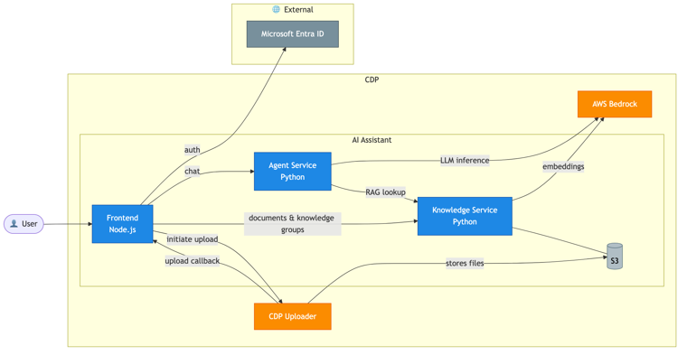
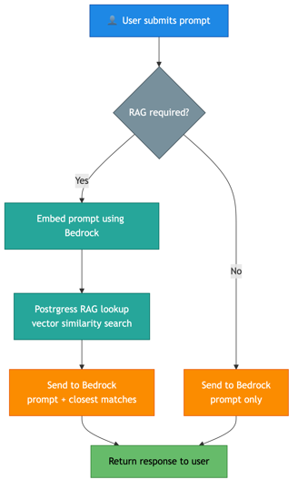
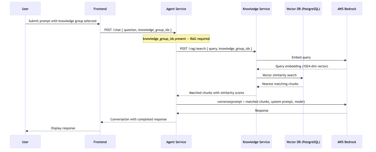
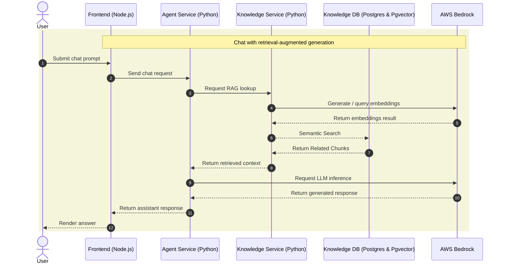
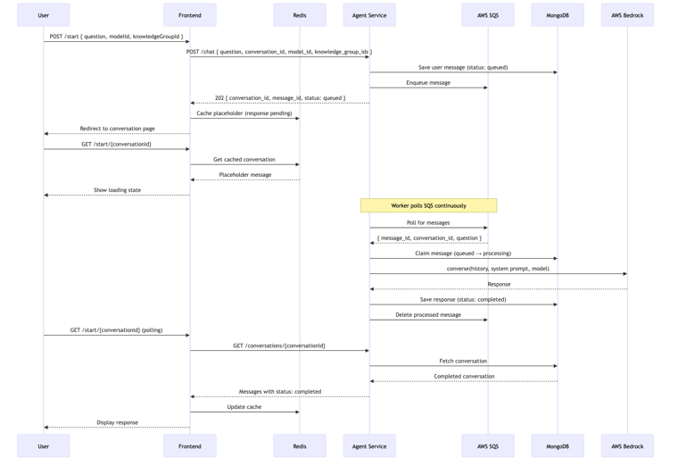
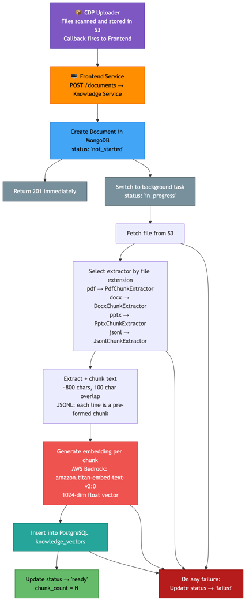
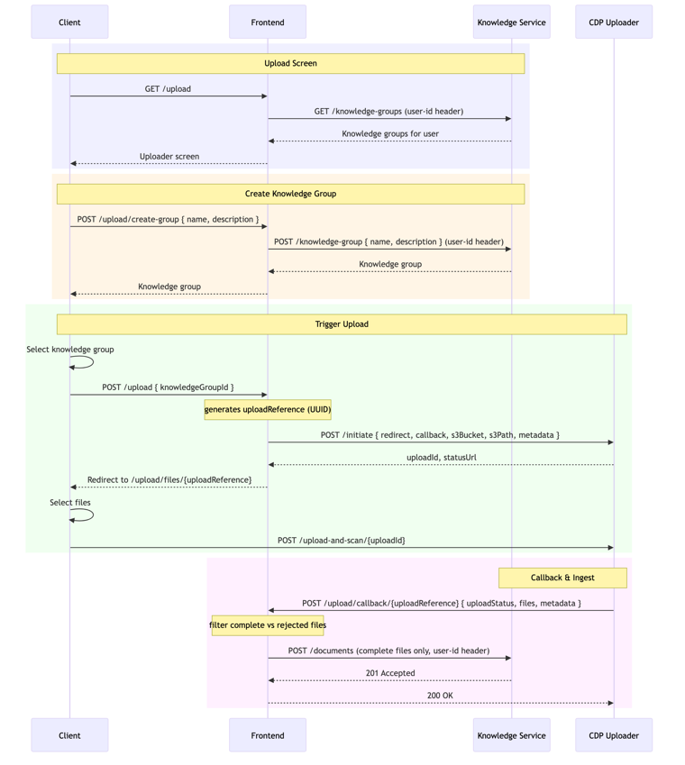
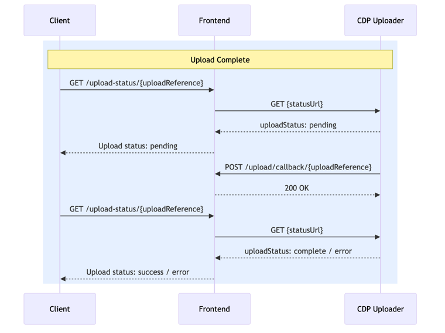
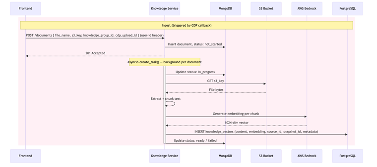
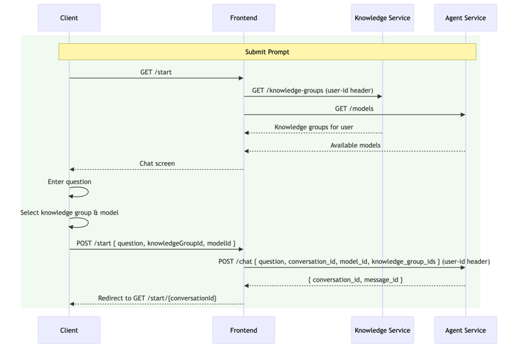

# Architecture

[← Back to Developer Docs](README.md)

> **Source:** ADR-004 — AI Assistant Architecture, repo analysis

---

## AI Assistant

This project is a reference implementation of a Retrieval-Augmented Generation (RAG) assistant, designed to demonstrate how AI-powered search and conversational interfaces can be deployed on the Core Delivery Platform (CDP).

It is intended as a practical starting point for any teams looking to deploy similar AI features. The system prompts have not been extensively optimised, and the data structures reflect a generalised design that may require adaptation for specific use cases. Teams are encouraged to treat this as an architectural reference for deploying similar capabilities on CDP.

---

## Services

### Frontend Service — Node.js + Redis

- User interfaces for chat, upload, and knowledge group management
- Auth flow via Microsoft Entra ID
- Short-term conversation cache via Redis
- Triggers document upload via CDP Uploader
- Receives CDP upload callback and notifies Knowledge Service

### Agent Service — Python

- Handles all LLM inference calls to AWS Bedrock
- Persists conversation history in MongoDB
- Orchestrates RAG lookup via Knowledge Service when required

### Knowledge Service — Python

- Manages document ingestion pipeline (extract, chunk, embed, store)
- Generates embeddings via AWS Bedrock (Titan Embed v2, 1024-dim, model: `amazon.titan-embed-text-v2:0`)
- Fetches uploaded files from S3
- Stores vector embeddings in PostgreSQL (pgvector)
- Stores document metadata and ingest status in MongoDB

---

## Infrastructure

| Component | Version | Role |
|---|---|---|
| PostgreSQL + pgvector | Custom Dockerfile | 1024-dim vector storage and nearest-neighbour search |
| MongoDB | 6.0.13 | Agent: conversations & messages · Knowledge: document metadata & ingest status |
| Redis | 7.2.3 | Frontend short-term conversation cache |
| LocalStack | 4.9.2 | Local AWS emulation (S3, SQS, SNS, Firehose) |
| Traefik | v3 | Reverse proxy and service routing |
| Microsoft Entra ID | Managed | User authentication (OAuth 2.0) |
| CDP Uploader | DEFRA managed | Secure file-to-S3 upload with callback |

---

## Authentication

| Layer | Mechanism |
|---|---|
| User → Frontend | Microsoft Entra ID (OAuth 2.0) |
| Frontend → Agent API | `X-API-KEY` header |
| Frontend → Knowledge API | `X-API-KEY` header + `user-id` header |
| Services → AWS | IAM role (production) / LocalStack (local dev) |

---

## GenAI Conversation Flow

All application functionality is driven by the conversation between the user and the AI. A user submits a prompt via the frontend, which is routed to the Agent Service for processing. The Agent Service determines whether the query requires a RAG lookup against the knowledge base, then constructs an appropriate request to AWS Bedrock. The resulting response is persisted to MongoDB and returned to the user through the frontend. This conversation loop forms the core interaction model of the system.

### High Level

### RAG Lookup Flow

The RAG implementation performs a vector similarity search against the knowledge base using an embedding of the user's prompt. In its current form this is an intentionally straightforward implementation — nearest-neighbour lookup with no re-ranking or query expansion. It serves as a functional baseline, and extending it with use-case-specific retrieval strategies (such as metadata filtering, hybrid search, or re-ranking) should be straightforward given the existing service boundaries.

The Agent decides per-request whether RAG is required, based on whether `knowledge_group_ids` are present in the request:

- **RAG path:** Embed prompt via Bedrock → pgvector similarity search → send prompt + matched chunks to Bedrock
- **No-RAG path:** Send prompt directly to Bedrock (LLM general knowledge only)

**RAG Lookup sequence:**

### Async GenAI Requests (Loading Spinner Pattern)

LLM inference via AWS Bedrock introduces latency that is incompatible with a synchronous request-response model. The frontend therefore implements an asynchronous polling pattern: an initial request queues the message and returns a conversation identifier immediately, while the frontend polls for completion. Teams implementing a similar chat interface or any asynchronous AI call pattern in their own services may find this approach a useful reference.

Key steps:

1. Frontend `POST /chat { question, conversation_id, model_id, knowledge_group_ids }` → Agent
2. Agent saves message with `status: queued`, enqueues to SQS, returns `202 { conversation_id, message_id, status: queued }` immediately
3. Frontend redirects to conversation view and begins polling `GET /conversations/{conversationId}`
4. SQS Worker polls continuously; dequeues message → optional RAG lookup → `converse(history, system_prompt, model)` on Bedrock → saves response to MongoDB → deletes SQS message
5. Frontend polling receives completed message and updates Redis cache

A couple of polish tweaks you might also like:

rename “Generate / query embeddings” to “Embedding lookup” for shorter labels

rename “Mark document available” to “Index document” if indexing is actually happening

add %% comments above each section if this is going into source control

I can also produce a dark-theme styled Mermaid version optimized for Confluence, GitHub, or Markdown docs.

---

## Knowledge Upload and Ingestion

Document ingestion begins when the CDP Uploader delivers a file to S3 and fires a callback to the Frontend Service. The Frontend Service notifies the Knowledge Service, which takes responsibility for the remainder of the pipeline: extracting and chunking the document text, generating vector embeddings via AWS Bedrock, and storing the results in PostgreSQL for subsequent RAG retrieval.

**Chunking parameters:** 800 characters per chunk, 100 character overlap. JSONL files are handled differently — each line is treated as a pre-formed chunk.

### High Level Ingest Journey

### Detailed Sequence Diagrams

#### Create Upload

#### Upload Complete

#### Trigger Ingest

Ingestion runs as a background task per document using `asyncio.create_task()`. Status progression: `not_started → in_progress → ready / failed`.

The task: fetch file bytes from S3 → extract and chunk text → generate 1024-dim embedding per chunk via Bedrock Titan Embed v2 → insert into `knowledge_vectors`.

#### RAG Lookup (Submit Prompt)

---

## Persistence

The Agent Service owns conversation and message state; the Knowledge Service owns document metadata and vector embeddings.

See [DATA-MODELS.md](DATA-MODELS.md) for full field reference.

### Agent Service Data Model

### Knowledge Service Data Model

